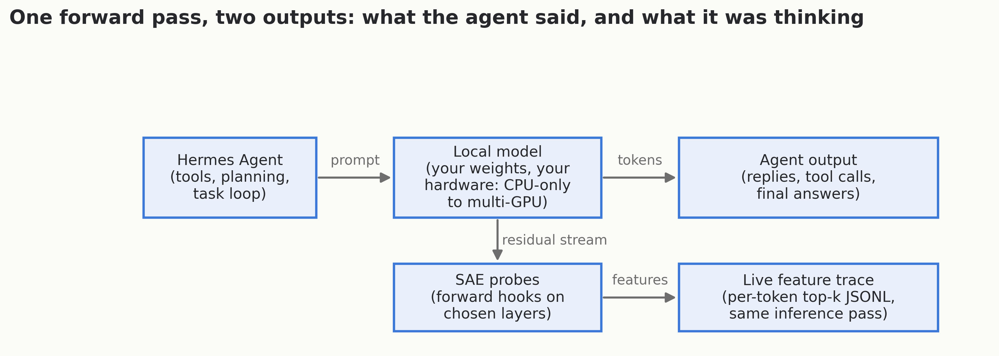

# hermes-sae — watch a local model think while it runs an agent

SAE (sparse autoencoder) interpretability for **local models doing real agentic
work** — built around [Hermes Agent](https://github.com/NousResearch/hermes-agent),
running on consumer hardware.

The core artifact is an OpenAI-compatible serving layer with SAE forward hooks:
the **exact same `model.generate()` call** that produces the agent's output also
yields the SAE feature activations over the residual stream. The transcript
tells you what the agent said; the feature trace tells you what the model was
doing internally while it said it.



## The same-inference invariant

If you label or trace with one model instance and then re-run the text through
a hooked model to get SAE features, you have **two inferences** — and
activations can diverge (sampling, KV state, device placement). That is
unfaithful. Here, forward hooks are registered on the decoder layers of the
one call that serves the agent:

- `out_ids` → decode → **the agent's output**
- captured residuals at the same generated positions → **SAE features**

Both derive from one forward pass / one KV cache, written into one record.
`meta.same_inference == True` is asserted per row, and `gen_text` has been
verified byte-identical between the engine-direct and HTTP-server paths.

## What's demonstrated so far

1. **Feature separability at 27B scale** — on a real 181-turn agentic trace
   (Qwen3.5-27B, fp16, 2× Tesla M40, 5 SAE layers, d_sae=81920/layer),
   37–44% of features firing in ≥20 turns survive BH-FDR (α=0.05) as
   discriminators of insider vs. clean scenario turns, with presence-only
   signatures at every layer. Full stats, caveats, and what this does *not*
   establish: [`B1_REAL_27B_REPORT_2026_07_20.md`](B1_REAL_27B_REPORT_2026_07_20.md).
2. **Agent-integrated capture inside Hermes Agent** — a local model
   (Gemma-4-E2B, NF4, 4 GB GPU) served *as the Hermes Agent model* with
   residual-stream capture of the exact inferences that drove the agent, plus
   behavioral analysis (a degenerate-loop attractor detected from activation
   geometry, not from the transcript):
   [`2026-07-19-agent-integrated-sae-capture/`](2026-07-19-agent-integrated-sae-capture/).
3. **CPU-only replication in one command** — the same pipeline on gpt2-small
   and Qwen2.5-0.5B with publicly released SAEs, no GPU required:
   `./setup_cpu_test.sh qwen25b`. See [`validation_cpu/`](validation_cpu/).

## Quickstart (no GPU needed)

```bash
git clone https://github.com/SolshineCode/hermes-sae
cd hermes-sae
./setup_cpu_test.sh qwen25b   # fetches model + released SAE, runs a hooked capture
```

For the minimal standalone probe (any HF model + matching SAE, live per-token
feature stream in ~130 lines), see [`probe-demo/`](probe-demo/).

To serve a hooked model to Hermes Agent (or any OpenAI-compatible client):
`sae_serve.py` exposes `/v1/chat/completions` and writes a feature-trace JSONL
sidecar per request. Point Hermes at it as a custom provider — the recipe is in
[`2026-07-19-agent-integrated-sae-capture/LOCAL_MODEL_IN_HERMES_AGENT.md`](2026-07-19-agent-integrated-sae-capture/LOCAL_MODEL_IN_HERMES_AGENT.md).

## Repo map

| Path | What it is |
|------|------------|
| `hermes-sae-trace/` | Hermes Agent plugin `sae_trace`: correlates agent turns with SAE feature traces. Staged here for extraction to its own repo (`SolshineCode/hermes-sae-trace`); pip-installable, catalog-ready |
| `SAE_TRACE_PLUGIN_HANDOFF.md` | Follow-up plan for publishing `sae_trace` as its own repo + Hermes catalog entry |
| `sae_serve.py` | OpenAI-compatible serving layer with SAE hooks + JSONL sidecar |
| `probe-demo/` | Minimal standalone probe (one file, one command) |
| `2026-07-19-agent-integrated-sae-capture/` | Local model *as* the Hermes Agent model, with capture + analysis |
| `sae_labeled_course.py`, `labeler_service.py` | Same-inference SAE + labeling instrument (the original course) |
| `fast_dpilot_sep.py`, `analyze_dpilot_separability.py` | Separability analyzers (rank-AUC, permutation p, BH-FDR) |
| `B1_REAL_27B_REPORT_2026_07_20.md` | The 27B separability result, in full |
| `FALSIFIABLE_CLAIM_DESIGN.md` | Pre-registered claims + null-result conditions (written before data) |
| `FABLE5_AUDIT.md` | Independent adversarial audit of an earlier pipeline version — kept public; the fixes it forced are in the current analyzers |
| `validation_cpu/`, `validation_real_27B/` | Replication artifacts |
| `nous/` | Writeup + figures for the Nous Research / Hermes Agent community |

## Honest status

- Read-only observability is validated (same-inference capture at 27B and on
  CPU; agent-integrated capture inside Hermes Agent).
- The insider/clean separability result distinguishes *scenario pools*; whether
  features encode deception specifically requires the matched-pair test
  (pre-registered, not yet run).
- Feature **steering** (per-feature bias at serve time) is roadmap, not result.
- SAE dictionary quality varies by layer; feature labeling coverage is minimal
  so far.
- An earlier version of the statistics pipeline had real flaws — an independent
  adversarial audit ([`FABLE5_AUDIT.md`](FABLE5_AUDIT.md)) found them, and the
  current analyzers are the post-audit redesign. The audit stays in the repo on
  purpose.

Hardware context: the 27B results ran on a used Dell T7610 with 2× Tesla M40
24GB (< $200 of GPU); the agent-integrated capture ran on a ThinkPad's 4 GB
GTX 1650 Ti; the replication path needs no GPU at all. That's what these
results happened to run on, not a requirement — the capture path runs
wherever your model runs (CPU-only, one consumer GPU, Apple Silicon, or a
multi-GPU box), and the plugin side is pure file I/O with no GPU or torch
dependency. This is deliberately a consumer/homelab-grade instrument.

## License

MIT — see [LICENSE](LICENSE).
